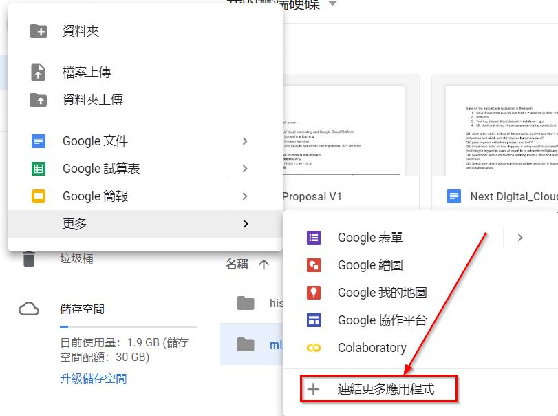
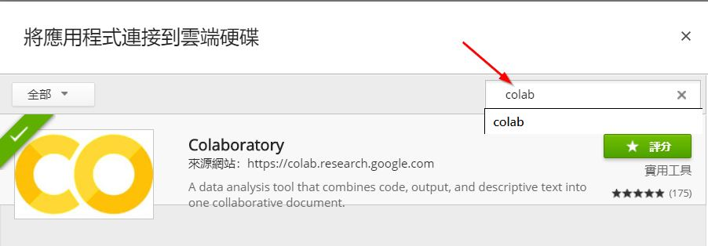

# T客邦Recommendation Course

## 簡介
預設使用Google co-laboratory: 線上jupyter notebook開發環境, 本機無須安裝任何套件, 至少需要有Gmail帳號

## 開啟Colab
1. Gmail右上角選單進入google drive <br/>
  
2. 點選左上角新增 <br/>
  
3. 點選連結更多應用程式 <br/>
  
4. 搜尋colab即可找到該應用程式, 開啟後直接可以在google drive上面看到.ipynb檔, 即可線上開發 <br/>
  
  
  詳細請參考[Cloud Colab](Cloud_Colab.pdf)

### Python Version: 3.5
會使用到的 Python 函式庫有：

1. NumPy, Scipy：矩陣運算函式庫
2. Scikit-learn：機器學習函式庫
3. Pandas：資料處理函式庫
4. TensorFlow(1.4+): Deep Learning函式庫
5. Jupyter Notebook：編譯器環境
<br/>
<br/>

## 本機使用安裝簡易教學 (Optional)

### 使用Anaconda
#### Step1 下載Anaconda
[Anaconda 官方文件 Install Tutorial](https://conda.io/docs/user-guide/install/windows.html)

#### Step2 Conda virtual env 安裝與使用
創建虛擬環境，打開終端機（Terminal），輸入：
```shell
conda create -n {env_name} python=3.5
```
{env_name}輸入自己取的名字

啟動虛擬環境(Windows)：
```shell
activate {env_name}
```
啟動虛擬環境(Mac, Linux)：
```shell
source activate {env_name}
```

#### Step3 Git Clone專案
```shell
git clone https://github.com/CloudMile/recommendation_course
```

安裝相關套件：

```shell
pip install -r requirements.txt
```

#### Step4 確認安裝完成，開啟 Jupyter Notebook
```shell
jupyter notebook
```

Jupyter Notebook 會開啟一個伺服器，通常網址是：[http://localhost:8888](http://localhost:8888)，在瀏覽器輸入網址就可以看到筆記本了，到這邊應該就完成環境的安裝了～


## Lab請開啟檔名lab開頭的notebook
```
lab_tutorial_dnn_practice.ipynb         DNN model training練習
lab_reco_model_mf.ipynb                 Recommendation Matrix Factorization基本款
lab_reco_model_mf_with_history.ipynb    Recommendation Matrix Factorization加入user interaction
lab_reco_model_mf_dnn.ipynb             Recommendation Matrix Factorization加入user interaction and item metadata
```

## 範例: 檔名非lab開頭的notebook
```
tutorial_dnn_practice.ipynb             
reco_memory_base.ipynb                  Collaborative filtering演算法
reco_model_mf.ipynb                     
reco_model_mf_with_history.ipynb
reco_model_mf_dnn.ipynb         
```
